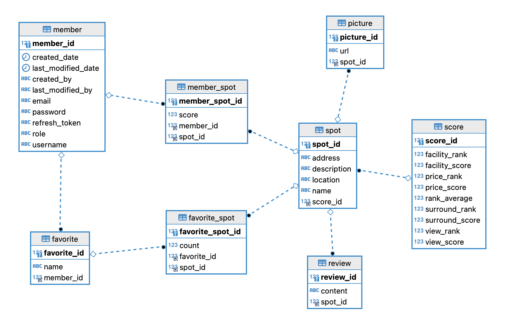

# :runner: Capstone-JejuTourRecommend

# :package: 역할

|백엔드|프런트엔드|AI|배포, 크롤링|
|:---:|:---:|:---:|:--:|
| - 주수헌(팀장, 본인)   [GitHub](https://github.com/suheonjoo) | - 정세연   [GitHub](https://github.com/n0eyes) | - 박은정   [GitHub](https://github.com/98pej11)  | - 정진찬   [GitHub](https://github.com/Esunsin) |

### Languages

### Technologies

<!----><!----><!----><!----><!---->--

# :star2: 소개 영상 및 설명

-   **기획동기:** 장기적인 코로나 시대에 국내 여행 증가로 제주도의 선호도가 높아졌으며, 기존의 제주도 관광 서비스 같은 경우 백과사전과 같은 관광지 소개로만 이루어져 있어, 관광지 선정에 매우 어려움이 있습니다.
-   **서비스 설명:** 80 만개의 제주도 관광지들의 댓글들 기반으로,ㅈ사상 4개의 카테고리로 관광지별 점수를 수치화 하였습니다. 사용자는 카테고리별 “가중치”를 주어 수치화된 점수들의 순위를 볼수 있으며, 사용자 기호에 맞게 여행 계획을 만들수 있습니다.

-   **사용기술**
    -   **Server:** SpringBoot, Spring Data JPA, MySQL, Querydsl
    -   **Crawling:** Selenium(셀레니움)
    -   **Frontend:** React
    -   **DevOps:** AWS EC2, RDS

## 서비스 설명
    

- 이 본 프로젝트는 사용자 맞춤 제주도 관광지 추천 플랫폼입니다
- 제주도 관광시, 주요 평가요소 4가지를 추려 조사하였고, 그에 따라 관광지 리스트를 보여줍니다
- 관광지 선호도 판단은 네이버와 카카오 댓글들 기반으로 ai를 적용하였으며 관광지 상세 페이지에 뷰, 가격, 시설, 카페및주변시설 로 카테고리를 나누어 수치화 하여 보여줍니다
- 저희가 만든 ai로 사용자에게 4가지 맞춤 서비스를 제공합니다.

1. 첫번째로, 메인 페이지에서 제주도를 동서남북으로 나눠, 검색할 수 있도록 하였으며 뷰, 가격 , 주변시설, 서비스 총 4가지 카테고리에 맞춰 수치화된 점수 기반으로 관광지를 순위대로 보여줍니다

2. 2번째는 만약 사용자가 카테고리별 세부 설정을 하고 싶으면, 우선순위 버튼으로 각 카테고리에 가중치를 주어, 이에 따라 관광지 순위를 보여줍니다.

3. 3번째는 관광지 상세페이지에서 관광지의 상세점수를 볼 수 있게 하였습니다

4. 4번째는 찜하기 기능으로, 사용자 만의 관광지 리스트를 만들었을 경우, 해당 관광지의 최단 경로를 보여줍니다. 또한 사용자의 각 위시리스트를 분석하여, 사용자 성향을 파악해 여행경로 주변 관광지를 추천해줍니다.

## 서비스 영상 링크

[여기](https://blog.naver.com/bluelaw_j/222783108548) 를 클릭하세요

## 서비스 화면

-  메인 페이지

- 상세 페이지

- 위시리스트 선택화면

- 위시리스트 추가화면

- 최단 경로

- 추천관광지 화면

- 가중치 화면

- 댓글 화면

# :package: 테이블 구성도

- 테이블 구상도

# :recycle: 심사위원 피드백으로 수정된 api

## 1. API 명세서 수정

본 프로젝트가 종료 되고 주변 지인 그리고 발표 영상 평가 및 심사위원님들의 피드백을 듣고 사용자 측면에서 더 편리한 UI를 고려하여 기존 API 명세서 내용을 수정하였습니다

### (1) 메인페이지에서 사용가 찜했던 관광지도 표시할수 있게 수정

- 사용자가 기존에 위시리스트에 관광지를 추가했는지 알수있게 표시하도록 하였습니다

### (2) 메인 페이지에서 사진 노출 1장 -> 3장

- 기존 메인 페이지에서 관광지별 사진에 마우스 커서를 갖다대면, 설명이 나오게 했습니다. 거기에서 추가로 사진 한장이 아닌 여러장을 볼수 있게 api를 수정하였습니다.

### (3) 위시리시트페이지 사진 노출 1장 -> 3장

- 기존에 위시리스트 페이지에서 위시리스트 화면의 사진을 대표 사진 한장으로 대체 하였으나 여러장으로 보여줄수 있게 하였습니다.
