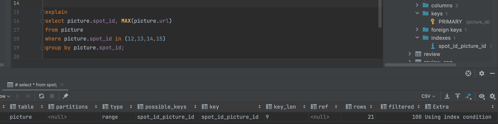
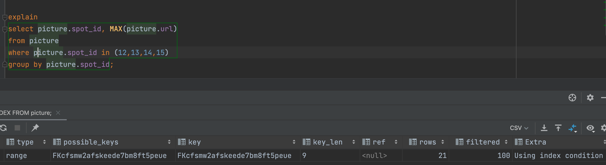
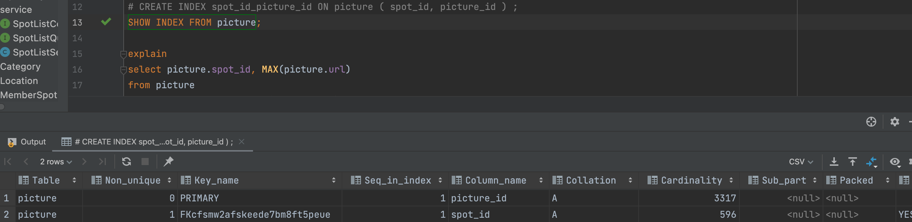

# 알게된 사실들


## 1. OSIV = false 로 설정으로 인한 에러
   - -> 대부분의 reference 에서는 비지니스 계층에서의 트랜잿션 그림 그려져 있었으나, view 에서 가져온 영속성 컨텍스트 또한 조회만 가능하여 수정 작업을 하려면 다시 리포지토리에서 해당 엔티티를 가져와야한다 
     - 결론: 비지니스 영역에서의 영속성 컨텍스트 내용은 뷰에서 수정 작업을 하면 안됬을 뿐만 아니라, 뷰 영역에서의 영속성 컨텍스트내용도 비지니스 영역에서 수정작업을 하면 안된다
   
## 2. 인덱싱

본 프로젝트에서 picture 테이블에서 spotId 기준으로 조회하는 쿼리가 대다수 이므로 이 것의 성능 최적화 할수 있는 방법이 있나 고민을 하였다 
그래서 인덱싱 이란 개념을 알게 되어 ~~(정말 힘들게 읽은)~~real MySQL 8.0 책에서 인덱싱 내용을 들여다 보았다 ~~(처음 인덱싱 내용을 봤을때 이해가 잘됐음 ㅠ)~~ 
우선 기본적으로 innodb 엔진 특성상 picture id 는 picture 의 unique 한값을 클러스터 인덱싱이 기본적으로 되어 있다. 그래서 난 추가적으로 spotId를 인덱싱에 추가하여 spotId, pictureId 순으로 복합 인덱싱을 하려고 하였고 그 조회 결과는 다음과 같았다



위 사진의 extra 는 Using index Condition, type 은 range 으로 인덱싱을 잘 잡아준 것을 볼수 있었다



그러나 인덱싱 하기 전의 실행계획을 첫번째 사진과 같이 extra 는 Using index Condition, type 은 range 으로 인덱싱을 잘 잡아준 것을 볼수 있었다
그래서 인덱싱을 주기 전의 인덱싱을 조회 해보니 아래 사진과 같이 pictureId, spotId 로 인덱싱이 이미 있었다



결론: 따로 사용자가 인덱싱을 잡아 주지 않아도 mysql 에서는 primary key 와 foreign key 로 이미 인뎅싱을 잡아 준다

# 내가 처리한 것

## JPA n+1 어떻게 처리했나?

1. 패치조인을 사용함, where in절 쿼리 내용이 적은 경우라. 한번에 가져와서 어플리케이션에서 filter하는게 맞다고 판단함
   - -> 한번에 다 조회해서 dto에 각각 담음
     - 2-1번하고 차이점은 이 service에 반환하는 api가 페이징dto가 아니여서 페치조인함, 페이징 컬렉션 페이징은 못하니깐

2. n+1 발생되는 테이블에서 조회를 하고 dto에 붙이는 형식으로 함 이때 여기서
   1. where 의 in절 조건 리스트가 많지 않는 경우: 그냥 디비에서 꺼내서 어플리케이션 영역에서 collection 자료구조의 groupby, limit를 사용해서  붙이는 형식으로 했음,한번에 많은 양을 디비에서 가져오는것은 리소스 과부하라고 생각
       - -> 어플리케이션에서 groupby, limit
   2. in절 조건에 리스트사이즈가 큰 경우:  디비에서 groupby, limit 로 처리함 -> db에서 groupby , limit c
      - 이후 real mysql 실행계획을 어떻게 보고 인덱싱 처리 유무를 어떻게 판단하는지 볼려고 구글링 엄청함 보니깐 intellij에 유용한 기능 엄청 많음.
        - 이걸로 실행계획 보고 드디어 real mysql 이 이해가기 시작했음 -> 진짜 백과 사전같이 볼수 있었음 
          - ~~(물론 처음볼때 이해가 안갔는데 어떻게든 정리하면서 한번 정독한게 도움 되었기에 가능한거 )~~


## 프로젝트 구조 

1. wishlist 패키지의 도메인 서비스 영역에서는 CommandUseCase와 QueryUseCase를 분리했는데, spot.main 패키지에서는 이 둘을 인터페이스로만 분리해 놓고 공용 서비스 구현체를 사용한 이유?
    - SpotListService에서의 관련 메서드들은 각각 2개 1개로 작았으며, 두 인터페이스가 공용을 사용하는 메서드가 있었기에 합치는 것이 맞다고 생각하였다
    - 만약 CommandUseCase와 QueryUseCase 의 메서드들이 많았다고 하면 따로 구현체를 분리 했을 것이며 공용 메서드를 처리하는 클래스를 따로 만들었을 것이다

2. 패키지를 spot, whishlist 로 나눈 이유는?
    - 원래 초기 Ver.1 프로젝트에서는 service, domain, repository, controller 패키지로만 나누었다. 그러나 프로젝트가 거대해지고 클랜 코드를 지키면서 프로젝트 리팩토링을 진행해보니 한 패키지지에 많은 클래스와 인터페이스 덩어리가 있었다.
    - 이는 프로젝트를 처음부터 설계한 본인도 프로젝트를 개선시 관련 클래스, 인터페이스들을 찾기가 어려웠으면 구조 수정이 필요하다고 생각하였다
    - 그래서 패지키의 큰틀을 먼저 나누어야 겠다고 생각하여 관광지에 초첨이 더 맞춰져 있는 클래스들을 spot으로 두었고
    - 관광지보다 사용자 찜하기 목록에 관련된 클래스들은 whishlist 패키지로 나눠었다
    - 물론 이렇게 분리하고 공통으로 사용된 클래스들을 어디에다가 놓아야 할지 계속 고민중이다.
      - 일단 현 상황에서는 프로젝트 클래스 이름이 Favorite 과 같은 사용자 입장과 가까운 클래스들은 whishList 패키지에 나누었고, 
      - 관광지 정보, 사진, 리뷰 와 같이 관광지의 정보에 추점을 둔 클래스들은 spot 패키지에 두었다.

3. spot 패키지 안에도 mainspot, detailspot 은 어떤 기준으로 나눈 것인가?
    - 기존 ver.1 에서처럼 해당 피키지 내부를 service, domain, repository, controller 으로만 나눌려고 했으나, spot 패키지의 같은 경우 앞전 2번에서처럼 패키지를 나누어 관련 클래스들이 거대 했다,
        1. 그래서 더 디테일적으로 메인 페이지 관련된 mainSpot
        2. 관광지 세부 페이지와 관련된 DetailSpot 으로 패키지를 나누었다


4. 큰틀을 spot, whishList 로 패키지를 나누고 그안에 세부적으로 application, domain, infrastructure, presentation으로 나눈 이유는?
    - 기존 ver.1 이후 리팩토링 진행 후, controller, service, repository 내에서도 세부적으로 역할들을 나누다 보니 프로젝트가 거대해졌다. 그러다 보니 controller, service, repository 중에 하나만 고치게 되면 연관된 클래스들을 변경해야하는 것이 많았다
    - 이러한 변경에 유용하게 대응하기 위해 **패키지 또한 응집력의 필요성이 생겨** 각 패키지의 정보를 한개의 인페이스를 통해 소통하는 것의 필요성을 느꼈고 아래 와 같이 패키지를 나누었다.
      1. application 은 damain.service 를 컨트롤러가 직접적으로 호출하기 보다는 중간에 인터페이스를 만들어 controller 가 serivce 변경을 유연하게 대체 하기 위해 만든 패키지이다
      2. domain 은 entity와 해당 entity 들이 담당하는 역할들을 모아 놓은 곳이다
         - 내부에 domain.repository 패키지도 있는데 이는 리포지토리 구현체를 한번에 받는 인터페이스를 만들어 infrastructure.repository 패키지의 변경을 유연하게 대처하기 위해 만들었다
      3. infrastructure 는 오직 repository 구현체와 인터페이스들만 있는 패키지이다
      4. presentation 은 controller 역할을 하는 곳이다 


## enum 타입의 재발견

결론은: 1대1 대응관계 있는 집합덩어리라고 생각하게 되었다.
이렇게 결론만 놓고 보면 클래스도 여러 집합을 만들어서 관리할수 있다고 하는데 내가 생각하는 enum 장점은 아래와 같다

1. 공통된 필드로 한클래스에서 관리를 할 수 있다
-  이거 어떻게 보면 클래스에서 인터페이스를 활용하면, 되지 않냐라고 생각할수 있는데 더 큰 이유는 다음 2번에 있다

2. 같은 타입(enum)의 순회가 클래스 보다 자유롭다
- 순회가 자유롭다는 의미는 선언된 같은 enum 타입을 순회 로직을 한 클래스에서 관리할 수 있다는 것이다 -> 이렇게 순회가 자유로우면, 타입을 순회하면서 원하는 타입을 찾거가 공통 연산을 처리하기가 훨씬 쉬워진다
- ex) 위 예제에서 findYield() 메서드와 같이 타입 순회 수행하면서, 각 필드의 총합을 구하는 예이다 -> 만약 클래스로 다루었으면 인터페이스로 클래스를 상속을 받고 클래스들의 저장공간을 따로 만들어 순회를 해야한다 -> 그러나 한개의 enum 클래스 안에서 메서드 하나만 작성하면 된다
- 그 외에서 순회를 통해 관리하는 활용도는 무긍무진 하다

3. enum 의 1대1 대응관계의 집합의 특징을 이용해서 변경이 별로 없으며, 내용도 많지 않은 테이블로 관리할 수가 있다

요번 우테코 프리 코스 미션2를 통해 이전 졸업프로젝트로 했던 spring boot  프로젝트 도 개선할 수 있는 아이디어를 얻었다, 해당 프로젝트에서 이전에는 위치정보 저장 값을 전략 패턴을 사용하셔 해결하였다. 그러나 요번 enum 에 대해서 학습을 하니 1대일 관계의 집합이며, 변경도 자주 있지 않으며, 내용도 많지 않는 테이블 형태로 구성되어 있어서 적용하게 딱이다라고 생각하였다. 테이블관계는 아래 코드 위에 주석으로 확인할수 있다


아래 코드를 보면 enum 타입을 enum 타입 그룹으로 테이블 같이 포현하였다.

```
/**
 * 북 : 애월읍,제주시,조천읍,구좌읍,우도면
 * 동 : 남원읍, 표선면, 성산읍
 * 서 : 한림읍, 한경면, 대정읍, 안덕면
 * 남 : 서귀포시
 */
public enum LocationGroup {

	NORTH_LOCATION(List.of(Location.Aewol_eup, Location.Jeju_si, Location.Jocheon_eup, Location.Gujwa_eup, Location.Udo_myeon),"북부"),
	EAST_LOCATION(List.of(Location.Namwon_eup, Location.Pyoseon_myeon, Location.Seongsan_eup),"동부"),
	WEST_LOCATION(List.of(Location.Seogwipo_si),"서부"),
	SOUTH_LOCATION(List.of(Location.Seogwipo_si),"남부"),
	ALL_LOCATION(List.of(Location.Jeju_si, Location.Aewol_eup, Location.Hallim_eup,
		Location.Hangyeong_myeon, Location.Jocheon_eup, Location.Gujwa_eup,
		Location.Daejeong_eup, Location.Andeok_myeon, Location.Seogwipo_si,
		Location.Namwon_eup, Location.Pyoseon_myeon, Location.Seongsan_eup, Location.Udo_myeon), "전체");

	
	private final List<Location> locations;
	private final String KrName;

	LocationGroup(List<Location> locations, String krName) {
		this.locations = locations;
		this.KrName = krName;
	}

	public static List<Location> getLocations(String krName) {
		return Arrays.stream(LocationGroup.values())
			.filter(i -> i.KrName.equals(krName))
			.map(i -> i.locations).findFirst().orElseThrow(() -> new UserException("카테고리의 제대로된 입력값을 넣어야 합니다"));
	}

}
```

먼저 Location 을 enum 타입으로 만들었으며, 이러한 enum 타입을 enum group으로 묶었다
순회하는 메서드는 getLocations()을 통해서 구현하였다.


아래 코드는 최종 서비스 영역에서 개선된 코드이다

```
public List<Location> findLocation(MainPageForm mainPageForm) {
		if (!StringUtils.hasText(mainPageForm.getLocation())) {
			throw new UserException("지역에 null 값이 들어갔습니다");
		}
		return LocationGroup.getLocations(mainPageForm.getLocation());
	}
```

아래코드는 이전에 전략 패턴을 사용한 코드다


```
public List<Location> findLocation(MainPageForm mainPageForm) {
		if (!StringUtils.hasText(mainPageForm.getLocation())) {
			throw new UserException("지역에 null 값이 들어갔습니다");
		}
		LocationStrategy locationStrategy;
		String location = mainPageForm.getLocation();
		switch (location) {
			case "북부":
				locationStrategy = new NorthLocation();
				break;
			case "동부":
				locationStrategy = new EastLocation();
				break;
			case "서부":
				locationStrategy = new WestLocation();
				break;
			case "남부":
				locationStrategy = new SouthLocation();
				break;
			case "전체":
				locationStrategy = new DefaultLocation();
				break;
			default:
				throw new UserException("카테고리의 제대로된 입력값을 넣어야 합니다");
		}
		return locationStrategy.getLocation();
	}
```


