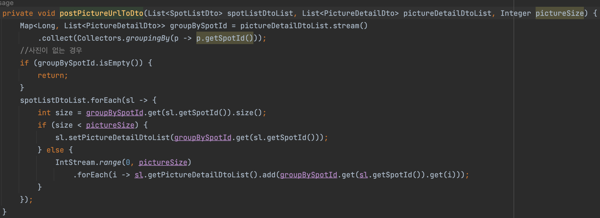

# JPA N+1 문제 해결사항

관광지 entity와 사진 entity가 일대다 로 연결되어 있는 상황입니다

## 패치조인 사용하기

조회되는 관광지 개수가 적을 경우 패치 조인으로 데이터를 가져와 n+1문제를 해결하였습니다.
조회되는 관광지 개수가 많을 경우 아래와 같이 해결하였습니다.

## 일대다 관계에서 "다(many)"에 해당하는 데이터 먼저 조회
 
 - ToOne 관계들을 먼저 조회하고, ToOne관계에서 얻은 "식별자 관광지 아이디"로 ToMany 관계인 사진 URL 한꺼번에 조회하였습니다.
- 그리고 map을 사용하여 관광지 아이디를 매칭하였습니다. 
	- -> 그러자 성능 향상이 O(1)로 줄어들게 되었습니다.
- 이렇게 접근하니, 수만 개의 데이터를 가져오려 해도 전보다 2배의 성능 개선을 할 수 있었습니다

