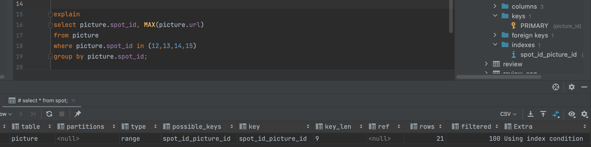
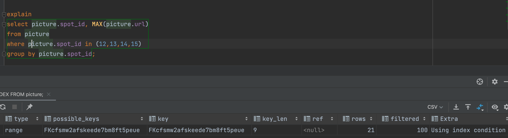
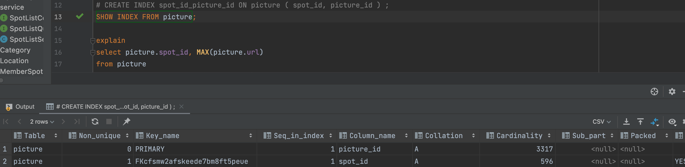

## 2. 인덱싱

본 프로젝트에서 picture 테이블에서 spotId 기준으로 조회하는 쿼리가 대다수 이므로 이 것의 성능 최적화 할수 있는 방법이 있나 고민을 하였습니다. 그래서 인덱싱 이란 개념을 알게 되었고 “real MySQL 8.0 책”을 구매하여 인덱싱 내용을 들여다 보았습니다
우선 기본적으로 innodb 엔진 특성상 picture id 는 picture 의 unique 한값을 클러스터 인덱싱이 기본적으로 되어 있스빈다. 그래서 난 추가적으로 spotId를 인덱싱에 추가하여 spotId, pictureId 순으로 복합 인덱싱을 하려고 하였고, 그 조회 실행계획은 다음과 같았습니다

위 사진의 extra 는 Using index Condition, type 은 range 으로 인덱싱을 잘 잡아준 것을 볼 수 있었습니다.

그러나 인덱싱 하기 전의 실행계획을 첫번째 사진과 같이 extra 는 Using index Condition, type 은 range 으로 인덱싱을 잘 잡아준 것을 볼수 있었습니다. 그래서 인덱싱을 주기 전의 인덱싱을 조회 해보니 아래 사진과 같이 pictureId, spotId 로 인덱싱이 이미 있었습니다.

결론: 따로 사용자가 인덱싱을 잡아 주지 않아도 mysql 에서는 primary key 와 foreign key 로 이미 인덱싱을 잡아 줍니다

- 물론 따로 인덱싱을 잡아주지 않아도 mysql 옵티마이저가 알아서 인덱싱을 잡아주지만 명시적으로 복합키를 인덱싱을 잡아주게 하였습니다